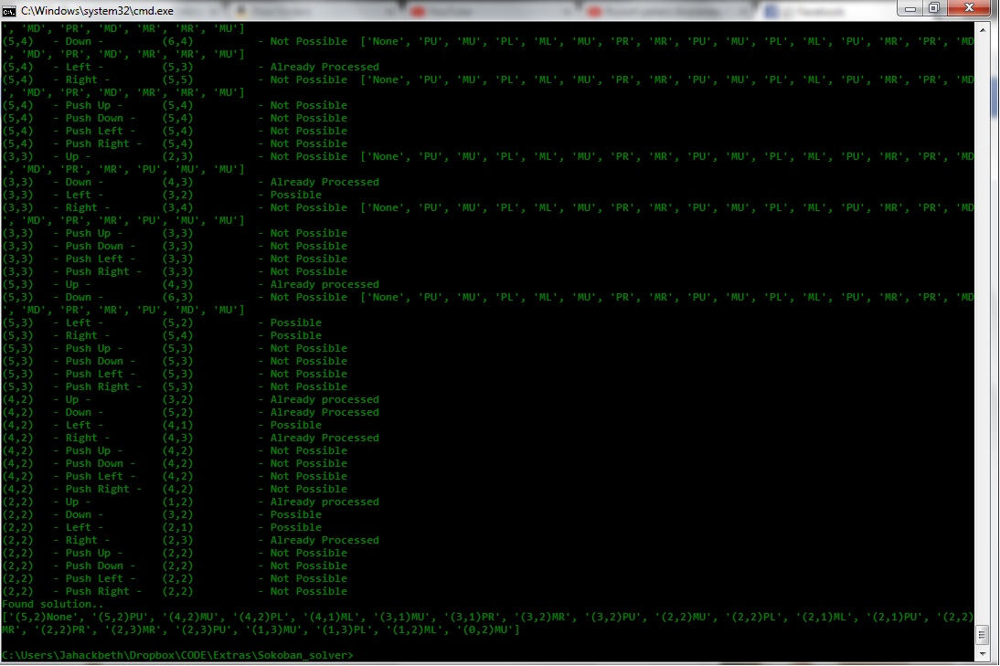

# Pokemon Emerald Sokoban Puzzle Solver

This project mainly spawned out of me getting stuck on a sokoban type puzzle on pokemon emerald and wanting to write a search algorithm that would solve it for me.

_1453526692286.png)

### Results : ###

Works pretty well. Always finds the solution if it exists. Can be improved with informed search and some heuristics.

Result obtained from the solver:

_1453526800527.png)

## Main Idea

The character in the puzzle is allowed to move in any direction and push the boulders to reach the final position. Considering game constraints it is safe to assume that there are only 8 possible moves possible in any given game state:

Given that final position of player is permissible, not blocked by a boulder and within bounds of the game screen:

- Move Up
- Move Right
- Move Down
- Move Left

Given a boulder exists in the push direction, pushing the boulder is a valid move, nothing blocks the boulder in the push direction and pushed boulder is within game screen:

- Push Up
- Push Right
- Push Down
- Push Left

The implicit state space graph will consist of nodes describing the current position of the character and the current state of the boulders in the game screen.

Each node will have at most 8 possible child nodes describing states reachable by making any of the 8 possible moves.

We then perform a blind Depth First search on the implicit graph. For every generated node we check whether goal state reached, if not, generate child nodes and continue the search. If all possible nodes generated and processed without reaching goal state, then the problem has no solution because in case of a finite state space DFS is a complete search algorithm and if a goal state exists then it can be found in finite amount of time.

However, this leaves open the problem of confining the state space to finite number of nodes. The algorithm needs to remember which game states have already been reached and/or processed.

## Confining the search state space ##

The algorithm needs to keep track of game states already generated and/or processed. Storing entire game state and searching through it for each iteration will be overkill.

We could instead digest the game state into a small unique hash which can be stored and used for comparisons. 

Each state is a combination of the current position of the character and current position matrix of the boulders. Since the matrix is comprised of only 1's and 0's, we can concatenate all rows and columns to receive a binary string which can be converted to a decimal number.

This gives us a pretty neat hash function which is guaranteed to be unique for each unique game state.

	hash(gamestate) = concatenate(
							gamestate.player_position.x,
							gamestate.player_position.y,
							str(
								int(
									concatenate(all rows of gamestate.boulder_position_matrix)
								)
							)

Each time a game state node is generated, we calculate its hash and store it in memory. Each time a child node is generated, we check whether the game state represented by the child node was already achieved before b comparing its hash to the currently stored hashes.

This will effectively stop the Depth First search from getting stuck in circular loops, making the same step of reversible moves repeatedly, or getting stuck on an un-solvable state.

## Usage ##

The algorithm accepts a start state and goal state which are simply 2-d positions of the game character(Ash).

    startpos = Position(5,2)
	goalpos  = Position(0,2)

We also need to supply the game state in the form of a matrix where 0 represents tile where the character can move and 1 represents a boulder.

	gameAreaSizeV = 6
	gameAreaSizeH = 5
	startAreaState = [
				[1,0,0,0,1],
				[1,1,0,1,1],
				[0,1,1,1,0],
				[1,0,0,0,1],
				[0,1,1,1,0],
				[0,0,0,0,0],
			]

If you want to see what the algorithm is doing, set debug_on to true. Its false by default.

	debug_on = False; //set to true for verbose output